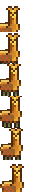

# gba-sprite-engine

This is a modified version of [wgroeneveld/gba-sprite-engine](https://github.com/wgroeneveld/gba-sprite-engine). The changes are:

- VRAM usage tweaks:
  * Now you can avoid filling up VRAM by reusing tiles: `sprite->setData(NULL); sprite->setImageSize(0);`. The sprite manager will reuse the last loaded sprite data.
  * Now `TextStream` uses *BG* 0, *Charblock* 3 and *Screenblock* 30. The *transparent tile* is 0.
- Performance tweaks:
  * Enabled compiler optimizations (`-Ofast`): 200% speed boost! ✔️ *(merged)*
  * Removed `while(1)`-based VSync. I'm using VBlank interrupts in my game's main loop.
  * All `Sprite`'s methods are now inline.
  * Some critical `GBAEngine` methods are now inline.
  * `Sprite`s now have an `enabled` property that can be used to pause `.update()` calls temporarily.
  * `Sprite::moveTo(x, y)` doesn't sync position and velocity anymore, there's no need.
  * Animation OAM is only written when the current frame has changed.
  * Moved `SpriteManager::copyOverSpriteOAMToVRAM()` to IWRAM.
- Library tweaks:
  * FIX: Now `Sprite::flipHorizontally(...)` and `Sprite::flipVertically(...)` can be called before `Scene::sprites(...)`, preserving OAM.
  * `Sprite::getX()` and `Sprite::getY()` now returns `signed int`s as expected. ✔️ *(merged)*
  * `FadeOutEffect` now receives an optional `FadeOutType` parameter (`ToWhite` or `ToBlack`) to customize it. Default is now `ToBlack`.
  * `Sprite`s now have a `setPriority(priority)` method.
  * `Allocator`'s `allocatedSprites` property is now public.
  * `Background`s now have a `useCharBlock(block)` method.
  * `Background`s now have a `usePriority(priority)` method.
  * `Background`s now have a `setMosaic(enabled)` method.
  * `Sprite`'s `oam` property is now public.
  * `Sprite::syncVelocity` was renamed to `Sprite::syncPosition`.
  * All `Sprite`s now have `MOSAIC_MODE` always ON (instead of always OFF).
- Removed features (for performance reasons):
  * `Sprite`'s velocity
  * `AffineSprite`s

## A high-level object-oriented Gameboy Advance sprite engine library

That's a mouthful - let's break that down:

#### High-level object-oriented

The GBA is an older piece of hardware that's missing an OS. While that is great (`while(1) {}`), it also means there's little software library support. GBA programming boils down to manipulating **memory-mapped IO** pointers. And that's not a lot of fun. 

Instead of writing

```C
vu16* paddle = ((volatile tile_block *)0x06000000)[0][1];
for (int i = 0; i < 4 * sizeof(tile_4bpp) / 2; i++) {
    paddle[i] = 0x2222;
}
```

Wouldn't it be a bit more readable if one could write

```C
auto paddle = SpriteBuilder<Sprite>()
    .withData(paddleTile, sizeof(paddleTile))
    .withLocation(10, 10)
    .buildPtr();
```

To leverage C++11's abilities combined with a clear object-oriented approach using abstraction to hide the hexadecimal addresses? That's the objective of this engine. 

**Speed and size are NOT the primary concern**! We value clean readable code above speedy algorithms. This is just a proof-of-concept, intricate games with a lot of data will never work because memory limitations. That said, feel free to fork and/or provide patches.
The C++ cross-compiler and the GBA work, but create more metadata than the typical C cross-compiler. Take a look at the file size of the following binaries:

```
-rwxr-xr-x   1 staff    8320 Jul 25 13:54 main_c.gba
-rwxr-xr-x   1 staff   23328 Jul 22 20:36 main_cpp.gba
-rwxr-xr-x   1 staff   24032 Jul 25 13:55 main_cpp_stl.gba
``` 

The C++ ROM is 280% bigger than the C ROM, and if you include <vector>, even 288% bigger - from 8K to 23K!
Emulating big files is not a problem, and running them on the actual hardware is still possible using cartridges like the EZ-FLASH Omega. 

#### GBA sprite engine

That means `MODE0`. 

#### library

It's compiled as a static library for your convenience. Simply link with the library and include the header path and you're all set.

## Engine features

A portion of [ToncLib](https://www.coranac.com/man/tonclib/main.htm) has been used as a low-level GBA accessor. If you know what you're doing, you can safely use those, headers are in `<libgba-sprite-engine/gba>`. 

BIOS methods and Sin/Cos lookup tables are also compiled in Assembly, as `sin_lut`.

Design overview:


Colored blocks are to be implemented in your own game. See below, in section "implementing your game".

### Implementing your own GBA Game

#### Scenes

Scenes contain sprites and backgrounds. You can transition between scenes with `engine->setScene(scene)` or `engine->transitionToScene(scene, effect)`. The main program bootstraps your first scene - from there on it's each scene's responsibility to load another one.

This is the layout of a main function:

```C
int main() {
    std::shared_ptr<GBAEngine> engine(new GBAEngine());

    auto startScene = new SampleStartScene(engine);
    engine->setScene(startScene);

    while (true) {
        engine->update();
    }

    return 0;
}
```

That's it!

To create your own scene, subclass `Scene` and implement:

1. `std::vector<Sprite *> sprites()`: the sprites to load into VRAM
2. `std::vector<Background *> backgrounds()`: your (multilayered) backgrounds
3. `void load()`: one-time scene loading (create your objects here)
4. `void tick(u16 keys)`: gets called each engine `update()`
5. set `foregroundPalette` and `backgroundPalette` in your load.

Loading up a scene usually involves creating some sprites with the builder. Don't forget to set the palettes like this: `std::unique_ptr<ForegroundPaletteManager>(new ForegroundPaletteManager(sharedPal, sizeof(sharedPal)));`

To add or remove sprites, you need to either call `engine->updateSpritesInScene` or add them all at first and use an object pool.

A simple fade out scene effect is implemented in demo 1, that converges the palette colors of both palettes to white. It's easy to **create your own effects** by subclassing `SceneEffect`. 


Sample fade effect, demo 1.

#### Backgrounds

Scrollable backgrounds are present:

Call `scroll()` in your scene update.


Sample scrolling background demo 1.

Creating a background: 

```C
    bg = std::unique_ptr<Background>(new Background(1, background_data, sizeof(background_data), map, sizeof(map)));
    bg->useMapScreenBlock(16);
```

If you want to create bigger maps than 32x32, use `MAPLAYOUT_64x64` or similar in the second constructor.

#### Sprites

Conjuring sprites on the screen is a matter of exposing them to the sprites vector in your scene. Create them in your load and set them as a `std::unique_ptr` member variable in your scene so they get cleaned up automatically. 

Creating sprites is easy with the `SpriteBuilder`. Specify your data `.with...()`. Done? Call `build()` to get a copy or `buildPtr()` to get a copy wrapped in a unique pointer. 

**Sprite animation is built-in**! Just feed your sprite data to the builder and use `.withAnimated(amountOfFrames, frameDelay)`. Remember to position each frame in one column in the image itself (vertically). Like this:



Useful sprite methods:

* `animate()`, `animateToFrame(x)` or `stopAnimating()`
* `flipVertically(bool)` or `flipHorizontally(bool)`
* `moveTo(x, y)`
* `collidesWith(otherSprite)` or `isOffScreen()`
* Various getters like `getWidth()` etc

Each sprite has own raw data, so there's no shared sprite image (for the better). The palette of course is shared, so think about that when exporting with a tool like [grit](https://www.coranac.com/man/grit/html/grit.htm) or [png2gba](https://github.com/IanFinlayson/png2gba). Grit has flags to export a shared palette:

> grit pic1.png pic2.png kul.png -ftc -pS -gB8 -O shared.c

Consult the [Grit list of cmdline options](https://www.coranac.com/man/grit/html/grit.htm) for more information.

Extracting a tilemap from a big image to create a splash-like intro screen can be done using these options:

> grit splashimage.png -gt -gB8 -mRtpf -mLs -ftc

It will export:

1. A tileset. Your data, to be injected into background VRAM char blocks.
2. A tilemap. Your metadata, to be injected into the next free background VRAM screen block.
3. A palette. Your one and only background palette.  

#### Sound

The engine supports **sounds** and **background music** using GBA's Active Sound channel A and B. It's a simple implementation meaning no mixing in either channels (but A and B are mixed).

Call `engine->enqueueMusic(data, sizeof(data));` as a repeating music or `enqueueSound()` as a one-timer. If some sound is already playing, it will **not be played**. Background music auto-repeats when done. See demo 1.

Sound can to be converted from a RAW Signed 8-bit PCM using [raw2gba](https://github.com/IanFinlayson/raw2gba). Record something with for example [Audacity](https://www.audacityteam.org/download/) and choose file -> export -> export audio... to change the format. Like sprite raw data, it'll be converted into a C header that you can feed to the methods above.

#### Text


There's a **default font embedded into the engine** using the `TextStream::instance()` static instance. It takes up background #4 and claims the last background palette bank so watch out with that! 

Useful text manipulation:

* `setText(txt, row, col)`
* `<< text` or `<< int` etc: append to text stream for debugging purposes.
* `setFontColor(COLOR)`: changes default color palette (white).
* `setFontStyle(const void* data, int size)` if you prefer your own font face.

Changing the font style assumes a tile width of 32 and the same symbol indexes! It also resets the font color and map so call this before doing anything else. 

#### Utilities

There's a game `Timer` class available using `engine->getTimer()`. It counts miliseconds, seconds, minutes and hours. 
Do not forget this is an estimate as modulo and divide operations are expensive. 

Each VBlank occurs every 280806 cycles (`CYCLES_PER_BLANK`), each cycle is 59.59ns
So, each VBlank occurs every 16.73322954 miliseconds or 16733.22954 microseconds.
The microseconds after the comma are rounded so irregularities are bound to occur after hours of timing..


#### Error logging

The text stream is also used if something goes wrong, there's a macro `failure_gba(WHOOPS)` that prints file, line, method and "exception" message to the text stream background. 

### Compiling everything

#### Prerequirements

1. cmake 3.12.x or higher: the cmake linker toolchain set contains a bug in .11
2. The [DevkitPro toolchain](https://devkitpro.org/wiki/Getting_Started) installed in your `$PATH`
3. The [mGBA emulator](https://mgba.io/downloads.html)

#### Compiling with cmake

The project has been developed with CLion. The `.idea` dir is there for you to get started. The project can be imported as a cmake project. 

As such, `CMake` was an easy choice. Use the following commands to build everything:

1. `mkdir cmake-build-debug && cd cmake-build-debug`
2. `cmake ./../`
3. `make`

Things you might need to change in `CMakeLists.txt` files:

1. gba-sprite-engine assumes your GBA cross-compiler is in your `$PATH`. If it's not, add an absolute path to `SET(CMAKE_C_COMPILER arm-none-eabi-gcc)` etc.

##### Building using Windows

Tested and working under Windows 10. Use [MinGW](http://www.mingw.org) or Cygwin, and add the `-G "Unix Makefiles"` option to your `cmake ./../` command. 

Cygwin is also a possibility, but combined with CLion the Unix and Windows path structures will clash. If using an IDE like CLion, resort to using MinGW.
